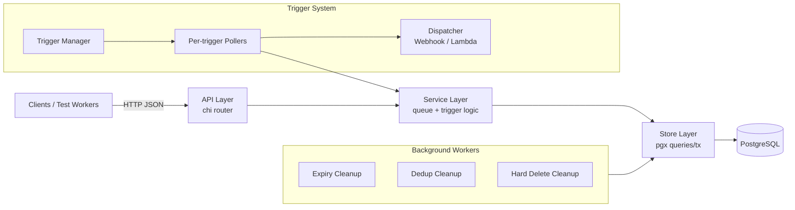
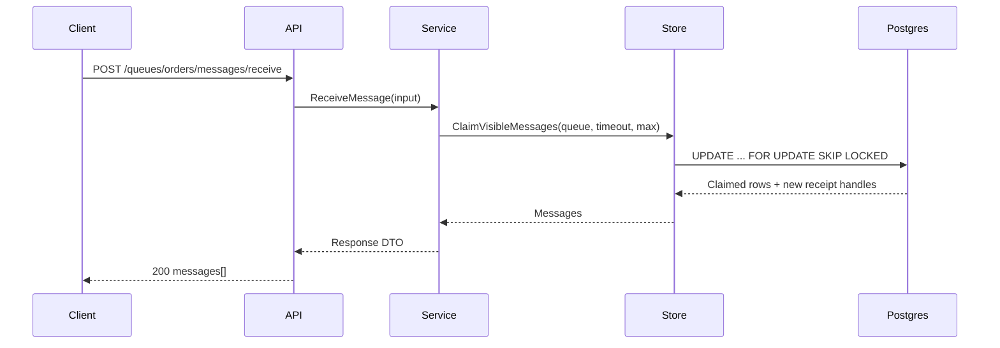

# EvtQ Architecture

## Table of contents

- [System overview](#system-overview)
- [Component breakdown](#component-breakdown)
- [Interaction flow](#interaction-flow)
- [Database design decisions](#database-design-decisions)
- [Concurrency model](#concurrency-model)

## System overview

EvtQ is a single-process HTTP service with PostgreSQL as the source of truth. The process runs synchronous API handlers plus asynchronous workers for trigger polling, retention cleanup, dedup cleanup, and garbage collection.

## Component breakdown

### API layer

- Built with `go-chi/chi`.
- Parses request payloads and query params.
- Maps service/store errors to stable HTTP responses.
- Exposes health and queue/message/trigger endpoints.

### Service layer

- Validates queue/message/trigger invariants.
- Applies defaults and constraints.
- Coordinates store operations into user-visible behavior.
- Encapsulates semantics (FIFO rules, retention limits, trigger validation).

### Store layer

- PostgreSQL access via `jackc/pgx/v5`.
- Performs atomic claim/update/delete operations.
- Uses explicit SQL to control lock behavior and reduce race conditions.
- Implements `LISTEN/NOTIFY` integration for long polling.

### Trigger system

- Trigger manager continuously reconciles enabled trigger definitions.
- Spawns one logical runtime per trigger, with configurable poller count.
- Pollers receive messages via the same receive paths as users.
- Dispatchers call target webhook/Lambda endpoint and map partial failures.
- Successful records are deleted; failed records reappear after visibility timeout.

### Background workers

- Expiry worker removes messages with `expires_at <= now()`.
- Dedup cleanup clears stale FIFO dedup material after dedup window.
- Hard-delete worker compacts soft-deleted rows.

See [Concepts](./concepts.md) for delivery semantics.

## Interaction flow

## Database design decisions

- PostgreSQL is the durability boundary for all queue state.
- Message availability is modeled as `visible_at` timestamp, not in-memory leases.
- FIFO ordering uses `sequence_number` and group-aware receive queries.
- Soft-delete + periodic compaction keeps hot-path writes simple.
- `LISTEN/NOTIFY` improves long-poll responsiveness without polling every request cycle.

Why PostgreSQL:

- Strong transactional guarantees.
- Mature locking primitives (`SKIP LOCKED`, advisory locks).
- Operational familiarity in most teams.
- Works well as single-node deployment for local/dev and moderate production loads.

## Concurrency model

- Each HTTP request executes in its own goroutine.
- Trigger manager and background workers run in long-lived goroutines.
- Database access uses pgx pool; each operation is short-lived and connection-aware.
- Standard queue claiming uses `FOR UPDATE SKIP LOCKED`.
- FIFO receive applies group-level filtering and locking so in-group messages do not overlap.
- Trigger workers apply configurable dispatch concurrency and backoff after repeated failures.

Related docs:

- [Design decisions](./design-decisions.md)
- [Triggers deep dive](./triggers.md)
