# EvtQ Concepts

## Table of contents

- [Message queues in EvtQ](#message-queues-in-evtq)
- [Standard vs FIFO queues](#standard-vs-fifo-queues)
- [Message lifecycle](#message-lifecycle)
- [Visibility timeout](#visibility-timeout)
- [Message groups and ordering](#message-groups-and-ordering)
- [Deduplication](#deduplication)
- [Delay queues](#delay-queues)
- [Long polling vs short polling](#long-polling-vs-short-polling)
- [Triggers](#triggers)

## Message queues in EvtQ

EvtQ stores messages durably in PostgreSQL and exposes queue semantics over HTTP. Producers enqueue payloads; consumers claim and process them under a visibility lease; acknowledgment deletes them.

## Standard vs FIFO queues

| Queue type | Delivery | Ordering | Throughput profile | Typical use |
|---|---|---|---|---|
| Standard | At least once | Best effort | Higher fan-out | Async tasks, events, retries |
| FIFO | Exactly once processing intent with dedup controls | Strict per message group | Lower due to ordering constraints | Payment flows, per-entity workflows |

Tradeoff:

- Use Standard for scale and loose ordering requirements.
- Use FIFO when ordering and duplicate suppression are core business requirements.

## Message lifecycle

1. **Send**: message is inserted with `visible_at` and `expires_at`.
2. **Available**: message is eligible when `visible_at <= now()`.
3. **Receive**: consumer claims message; new receipt handle is issued; `visible_at` moves into future.
4. **In-flight**:
   - **Delete** called: message acknowledged and removed.
   - **No delete** before timeout: message becomes visible again.
5. **Expiry**: worker removes messages after retention window.

## Visibility timeout

Visibility timeout is a lease, not an acknowledgment.

```mermaid
sequenceDiagram
    participant Producer
    participant EvtQ
    participant ConsumerA
    participant ConsumerB

    Producer->>EvtQ: Send message
    ConsumerA->>EvtQ: Receive message (visibility=30s)
    EvtQ-->>ConsumerA: Message + receipt_handle_1
    Note over EvtQ: Message hidden for 30s

    alt ConsumerA deletes in time
      ConsumerA->>EvtQ: Delete(receipt_handle_1)
      EvtQ-->>ConsumerA: 204
    else ConsumerA crashes
      Note over EvtQ: Lease expires
      ConsumerB->>EvtQ: Receive message
      EvtQ-->>ConsumerB: Same message + receipt_handle_2
    end
```

See [API reference](./api-reference.md#put-queuesnamemessagesreceipthandlevisibility) for changing visibility.

## Message groups and ordering

FIFO ordering is scoped to `message_group_id`:

- Messages in the same group are processed sequentially.
- Different groups can be processed in parallel.
- EvtQ receive query ensures one in-flight message per group.

This is why `group-A` can be strictly ordered while `group-1..group-6` run concurrently.

## Deduplication

FIFO dedup supports two modes:

- Explicit dedup ID (`message_dedup_id`)
- Content-based dedup (`content_based_dedup=true`)

Within dedup window, repeated sends are ignored/merged by dedup semantics.

## Delay queues

- Queue-level `delay_seconds` applies to all messages.
- Per-message delay can be set on send APIs.
- Effective availability is `now + queue_delay + message_delay`.

Maximum delay: 900 seconds.

## Long polling vs short polling

- **Short polling**: immediate return, may produce empty responses often.
- **Long polling**: wait up to 20s for new messages; fewer empty responses; lower client polling overhead.

EvtQ can combine retry loops with `LISTEN/NOTIFY` for faster wake-up.

## Triggers

Triggers are managed pollers that consume queue messages and invoke downstream targets:

- Webhook target (`target_type=webhook`)
- Lambda-style target (`target_type=lambda`)

Capabilities:

- Batch size + batch window
- Concurrency limits
- Partial batch failure handling
- Backoff/circuit-breaker behavior on repeated failures

Use triggers when you want push-like processing without building your own poller process. See [Triggers deep dive](./triggers.md).
