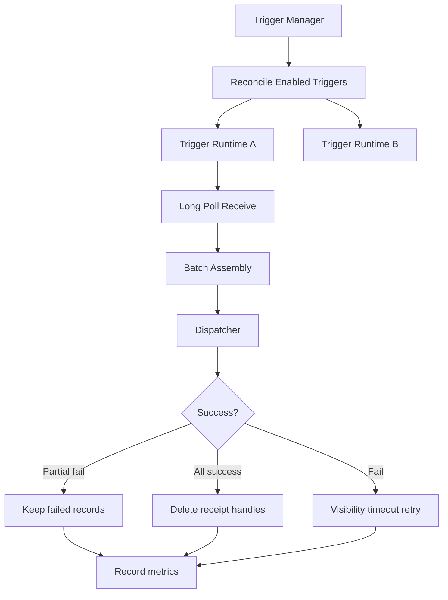
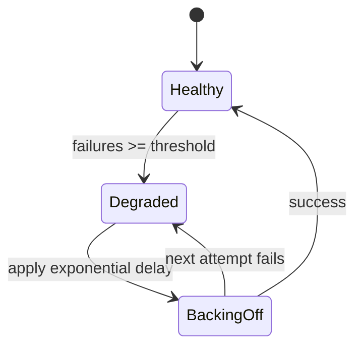
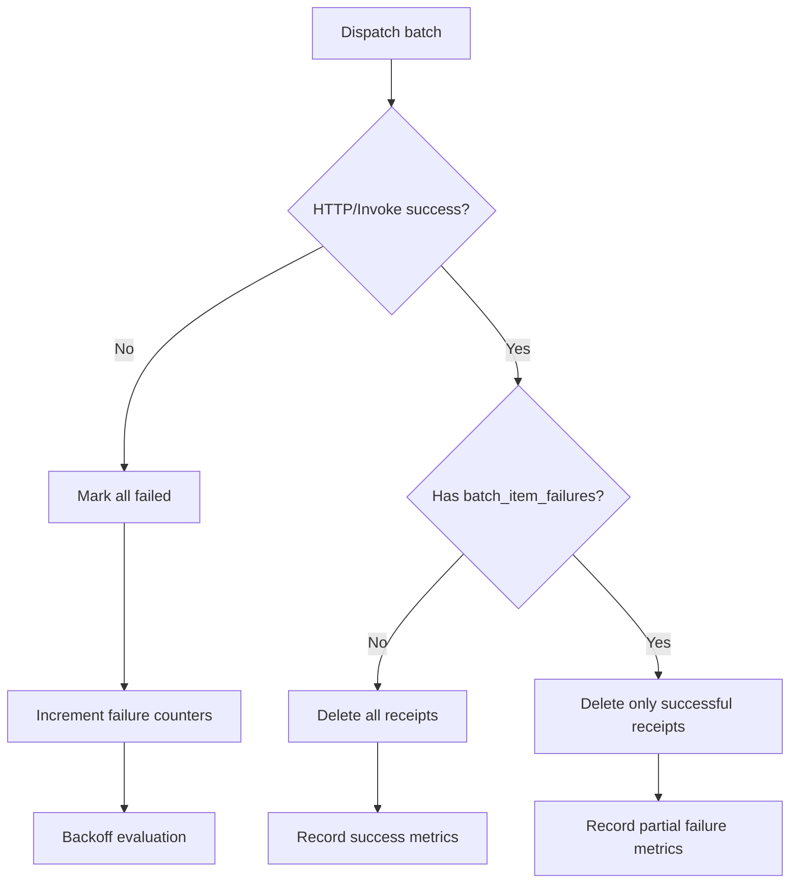

# EvtQ Trigger System

## Table of contents

- [Overview](#overview)
- [Internal architecture](#internal-architecture)
- [Webhook targets](#webhook-targets)
- [Lambda targets](#lambda-targets)
- [Batch windowing](#batch-windowing)
- [Partial batch failure handling](#partial-batch-failure-handling)
- [Concurrency control](#concurrency-control)
- [Circuit breaker and backoff](#circuit-breaker-and-backoff)
- [Error handling flow](#error-handling-flow)
- [FIFO ordering guarantees through triggers](#fifo-ordering-guarantees-through-triggers)

## Overview

Triggers are managed consumers bound to queues. Each trigger polls, dispatches, and acknowledges messages automatically.

Use triggers when you want event-driven processing without maintaining separate worker services.

## Internal architecture



## Webhook targets

Trigger config:

- `target_type=webhook`
- `target_url=http://...`

Dispatch request:

```json
{
  "trigger_id": "25cea116-8a1b-481d-bf45-c7e520fb6831",
  "invocation_id": "f57f77f5-f4e3-47e7-92d0-9d17ec89e6f4",
  "queue_id": "c133c865-2c48-4b6b-9c38-0453a5bb5cf6",
  "queue_name": "orders",
  "queue_type": "STANDARD",
  "source_queue": "orders",
  "target": "http://localhost:9000/hook",
  "records": [
    {
      "message_id": "023ab87a-5417-49a4-b010-4fa046bc56a2",
      "receipt_handle": "632985f5-5665-4ae5-9153-411262cd5e26",
      "body": "{\"order_id\":\"ord_1001\"}",
      "attributes": {},
      "approximate_receive_count": 1
    }
  ]
}
```

Success rule:

- HTTP 2xx means success.

Timeout:

- bounded by trigger/dispatcher timeout config.

## Lambda targets

Trigger config:

- `target_type=lambda`
- `target_url` (or function binding field depending on build) points to function identity.

EvtQ forwards payload to configured function runner endpoint and interprets partial failure contract like webhook mode.

## Batch windowing

`batch_size` and `batch_window_seconds` interaction:

- Poller receives initial set immediately.
- If fewer than `batch_size`, it waits up to `batch_window_seconds` for more records.
- Dispatch occurs on first of:
  - `batch_size` reached
  - window expiry

Implication:

- Larger windows improve batching efficiency, increase per-message latency.

## Partial batch failure handling

Target may return:

```json
{
  "batch_item_failures": [
    { "item_identifier": "023ab87a-5417-49a4-b010-4fa046bc56a2" }
  ]
}
```

Behavior:

- non-failed records are deleted
- failed records are left for retry after visibility timeout

Queue type specifics:

- Standard: independent retries are acceptable.
- FIFO: failed message can block later messages in the same group (expected).

## Concurrency control

- `max_concurrency` controls parallel dispatch workers per trigger runtime.
- `min_pollers` / `max_pollers` control poller count when autoscaling is enabled.
- semaphore-style limits prevent unbounded downstream fan-out.

When limit is reached:

- additional batches wait in poller runtime until execution slots free up.

## Circuit breaker and backoff

Trigger runtime tracks consecutive failures:

- below threshold: normal polling
- at/above threshold: exponential backoff before next dispatch
- success resets failure count

Backoff grows up to configured cap.



## Error handling flow



## FIFO ordering guarantees through triggers

EvtQ preserves FIFO ordering per `message_group_id` by:

- selecting only groups without active in-flight messages
- claiming lowest `sequence_number` first in each free group
- preventing concurrent same-group dispatch under receive-lock strategy

Guarantee scope:

- strict in-group order
- cross-group parallelism is allowed and expected

See [Concepts](./concepts.md#message-groups-and-ordering).
